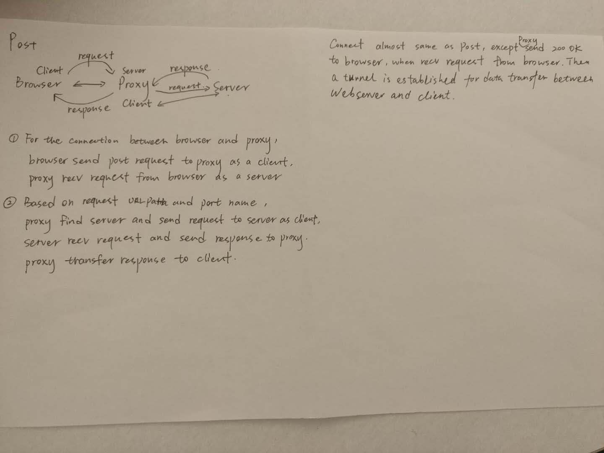
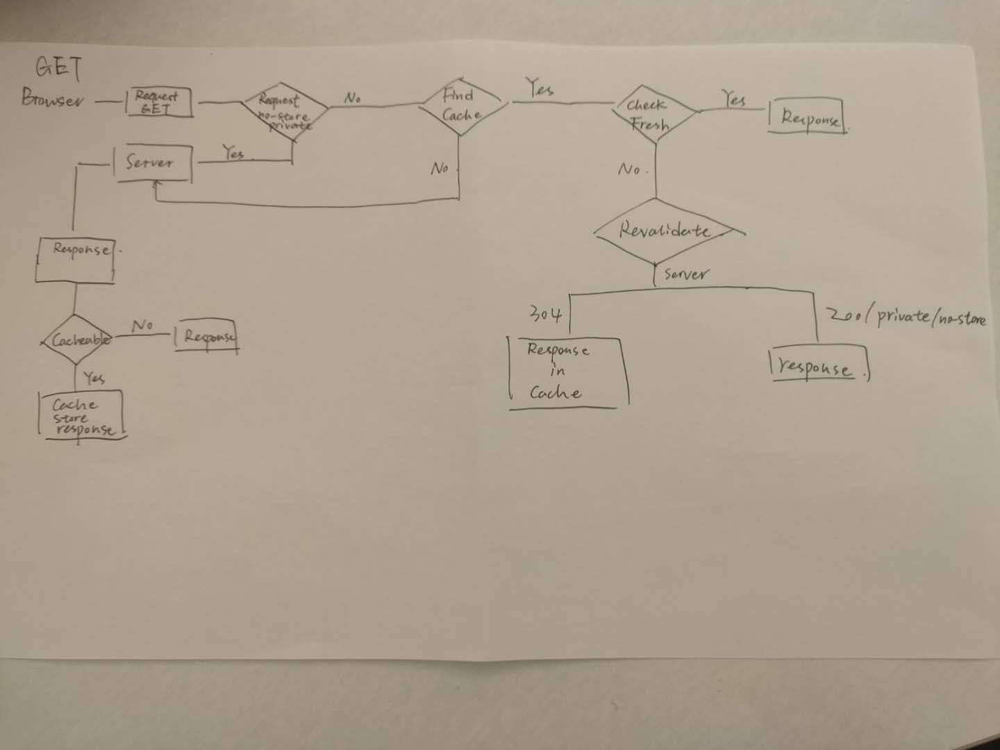

# erss-hwk2-ql101-cz130

This is a HTTP proxy that can handle GET (with cache), POST and CONNECT Post. Also, it can implemented multi-thread to handle with concurrency.
You could refer to log file to see the detail of request and response.

If you want to see GET, POST and CONNECT, as well as our cache policy, you could refer to two images:





To run our program, type

```
sudo docker-compose up
```

on the terminal. Wait a few seconds for the program to be fully compiled.

While the program is running, you can open ./proxy/proxy.log to monitor http request/response. Test cases with tips can be found in ./text.txt.

If you have any questions, please contact us!